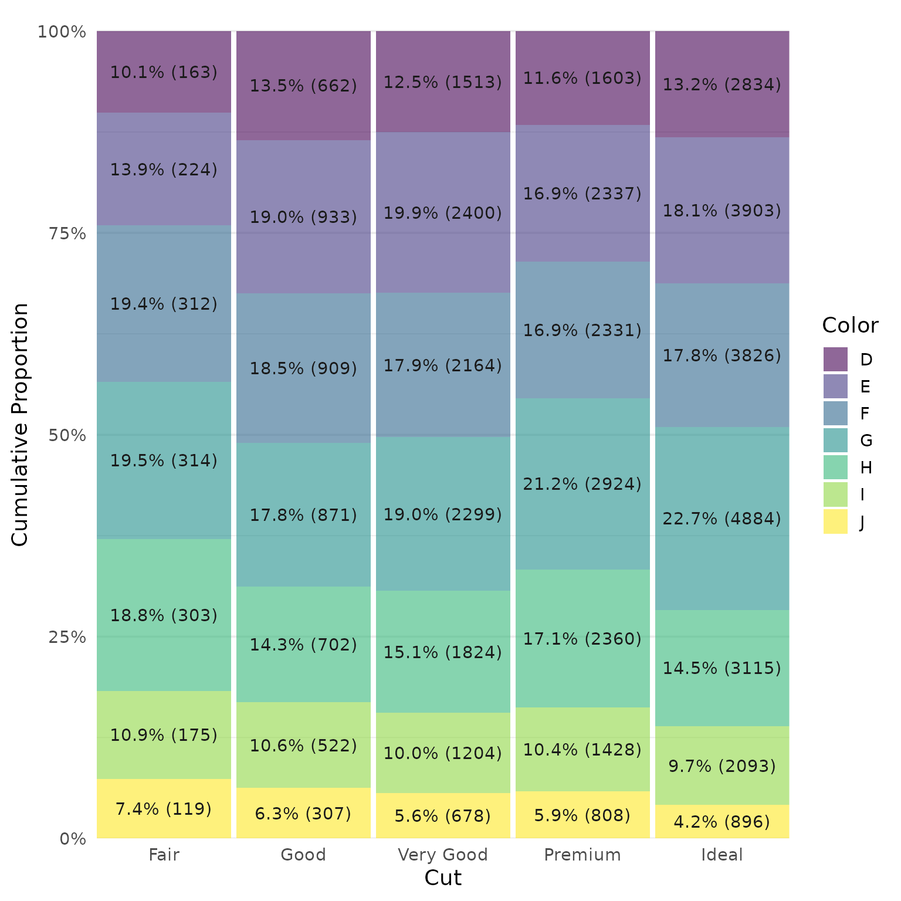

# Getting Started with apa7

## Tables

The apa7 package provides functions to create APA-style tables,
including correlation matrices and regression tables. The functions
return flextable objects that can be processed further using the
[flextable](https://ardata-fr.github.io/flextable-book/) package.
Although there are other fantastic packages for creating tables (e.g.,
[gt](https://gt.rstudio.com/),
[tinytable](https://vincentarelbundock.github.io/tinytable/), and
[kableExtra](https://haozhu233.github.io/kableExtra/)), the
[flextable](https://ardata-fr.github.io/flextable-book/) package has the
fullest support for the .docx format, which is essential for anyone
working in APA style. Thanks to the tireless efforts of David Gohel,
flextable can handle almost anything that can be done in a .docx table.

## Load Packages and Set Defaults

``` r

library(apa7)
library(flextable)
library(ftExtra)
library(dplyr)
library(tibble)
library(tidyr)
library(stringr)
library(psych)
set_flextable_defaults(theme_fun = theme_apa, 
                       font.family = "Times New Roman", 
                       text.align = "center", 
                       table_align = "left")
```

## Make Data

Suppose we have a table we want to format. As a raw tibble, it looks
like this:

``` r

d <- tibble(
  Model = paste("Model", c(rep(1,2), rep(2, 3))),
  Predictor = c(
    "Constant", "Socioeconomic status", 
    "Constant", "Socioeconomic status", "Age"),
  b = c(-4.5, 1.23, 
        -5.1, 1.45, -.23),
  beta = c(NA, .24, 
           NA, .31, .031),
  t = c(-18.457, 2.345, 
        -22.457, 2.114, .854),
  df = c(85,85, 
         84, 84, 84),
  p = c(.0001, .0245, 
        .0001, .0341, .544))

d
#> # A tibble: 5 × 7
#>   Model   Predictor                b   beta       t    df      p
#>   <chr>   <chr>                <dbl>  <dbl>   <dbl> <dbl>  <dbl>
#> 1 Model 1 Constant             -4.5  NA     -18.5      85 0.0001
#> 2 Model 1 Socioeconomic status  1.23  0.24    2.35     85 0.0245
#> 3 Model 2 Constant             -5.1  NA     -22.5      84 0.0001
#> 4 Model 2 Socioeconomic status  1.45  0.31    2.11     84 0.0341
#> 5 Model 2 Age                  -0.23  0.031   0.854    84 0.544
```

## Initial Results with `flextable`

If we use
[`flextable::flextable`](https://davidgohel.github.io/flextable/reference/flextable.html)
with the `flextable::thema_apa` function as the default theme, we get
something close to what we want:

``` r

set_flextable_defaults(
  theme_fun = theme_apa, 
  font.family = "Times New Roman", 
  text.align = "center",
  table_align = "left")

flextable(d) 
```

| Model   | Predictor            | b     | beta | t      | df    | p    |
|---------|----------------------|-------|------|--------|-------|------|
| Model 1 | Constant             | -4.50 |      | -18.46 | 85.00 | 0.00 |
| Model 1 | Socioeconomic status | 1.23  | 0.24 | 2.35   | 85.00 | 0.02 |
| Model 2 | Constant             | -5.10 |      | -22.46 | 84.00 | 0.00 |
| Model 2 | Socioeconomic status | 1.45  | 0.31 | 2.11   | 84.00 | 0.03 |
| Model 2 | Age                  | -0.23 | 0.03 | 0.85   | 84.00 | 0.54 |

Unfortunately, the journey from “close to what we want” to “exactly what
we want” often requires a series of polishing moves that can take a long
time and/or specialized knowledge to get right. Some steps along this
path might include:

- Convert `Model` to a row titles (i.e., Model 1, Model 2)
- Left align the `Predictor` columns
- Make `Predictor` column wider
- Negative numbers should have real minus signs (−) instead of hyphens
  (-).
- Align numeric columns on decimals.
- Format p-values and align them on the decimals
- Remove leading zeroes for `beta` and `p`
- Italicize statistic headings (e.g., `b` → *b*)

Of course, there are flextable functions that can do most of these
things, but applying them repeatedly is tedious. This is not a criticism
of flextable. As general-purpose package for table creation, flextable
should not be expected to anticipate the complex rules of specific style
guides. The fact that it has the `theme_apa` function is more than
generous already.

The `apa_flextable` tries to take care of all of these APA-Style
polishing moves with minimal fuss.

## Polished table with `apa_flextable`

``` r

apa_flextable(d, row_title_column = Model) 
```

| Predictor            | b     | β   | t      | df  | p      |
|----------------------|-------|-----|--------|-----|--------|
| Model 1              |       |     |        |     |        |
| Constant             | −4.50 |     | −18.46 | 85  | \<.001 |
| Socioeconomic status |  1.23 | .24 |   2.35 | 85  |  .02   |
| Model 2              |       |     |        |     |        |
| Constant             | −5.10 |     | −22.46 | 84  | \<.001 |
| Socioeconomic status |  1.45 | .31 |   2.11 | 84  |  .03   |
| Age                  | −0.23 | .03 |   0.85 | 84  |  .54   |

The row titles can be aligned to the left, center, or right.

``` r

apa_flextable(d, 
              row_title_column = Model, 
              row_title_align = "center") 
```

| Predictor            | b     | β   | t      | df  | p      |
|----------------------|-------|-----|--------|-----|--------|
| Model 1              |       |     |        |     |        |
| Constant             | −4.50 |     | −18.46 | 85  | \<.001 |
| Socioeconomic status |  1.23 | .24 |   2.35 | 85  |  .02   |
| Model 2              |       |     |        |     |        |
| Constant             | −5.10 |     | −22.46 | 84  | \<.001 |
| Socioeconomic status |  1.45 | .31 |   2.11 | 84  |  .03   |
| Age                  | −0.23 | .03 |   0.85 | 84  |  .54   |

Without a row_title_column specified, the `Model` column can be
vertically merged

``` r

d |> 
  mutate(Model = str_remove(Model, "Model ")) |> 
apa_flextable() |> 
  merge_v() |>
  align(j = "Predictor", part = "all") |>
  align(j = "Model", align = "center") |>
  valign(j = "Model", valign = "middle") |>
  surround(i = 2, border.bottom = flextable::fp_border_default()) |>
  width(width = c(.8, 1.75, rep(.8, 5)))
```

| Model | Predictor            | b     | β   | t      | df  | p      |
|-------|----------------------|-------|-----|--------|-----|--------|
| 1     | Constant             | −4.50 |     | −18.46 | 85  | \<.001 |
|       | Socioeconomic status |  1.23 | .24 |   2.35 |     |  .02   |
| 2     | Constant             | −5.10 |     | −22.46 | 84  | \<.001 |
|       | Socioeconomic status |  1.45 | .31 |   2.11 |     |  .03   |
|       | Age                  | −0.23 | .03 |   0.85 |     |  .54   |

## Conditional Formatting

A common problem with table formatting functions is that they try to do
too much in one function, making it difficult to customize the output.
Like the entire flextable ecosystem, the `apa_flextable` function is
designed to be flexible in terms of its inputs and allows for further
customization afterwards.

The `apa_flextable` function returns a flextable object that can be
further processed with flextable functions, if needed. For example,
suppose we wanted to bold the beta coefficient for the first predictor:

``` r

apa_flextable(d, row_title_column = Model) |> 
  bold(i = 3, j = 3)
```

| Predictor            | b     | β   | t      | df  | p      |
|----------------------|-------|-----|--------|-----|--------|
| Model 1              |       |     |        |     |        |
| Constant             | −4.50 |     | −18.46 | 85  | \<.001 |
| Socioeconomic status |  1.23 | .24 |   2.35 | 85  |  .02   |
| Model 2              |       |     |        |     |        |
| Constant             | −5.10 |     | −22.46 | 84  | \<.001 |
| Socioeconomic status |  1.45 | .31 |   2.11 | 84  |  .03   |
| Age                  | −0.23 | .03 |   0.85 | 84  |  .54   |

Some flextable functions that take care of common formatting problems.
All of these can be applied to specific column names/positions or row
positions. The row positions can be selected conditionally based on data
in each row.

| Function | Purpose |
|----|----|
| Text |  |
| [bold](https://davidgohel.github.io/flextable/reference/bold.html) | Bold text |
| [color](https://davidgohel.github.io/flextable/reference/color.html) | Color text |
| [font](https://davidgohel.github.io/flextable/reference/font.html) | Font family |
| [fontsize](https://davidgohel.github.io/flextable/reference/fontsize.html) | Font size |
| [highlight](https://davidgohel.github.io/flextable/reference/highlight.html) | Highlight color |
| [italic](https://davidgohel.github.io/flextable/reference/italic.html) | Italicize text |
| Cell |  |
| [align](https://davidgohel.github.io/flextable/reference/align.html) | Horizontal alignment |
| [bg](https://davidgohel.github.io/flextable/reference/bg.html) | Background color |
| [line_spacing](https://davidgohel.github.io/flextable/reference/line_spacing.html) | Line spacing |
| [padding](https://davidgohel.github.io/flextable/reference/padding.html) | Cell padding |
| [rotate](https://davidgohel.github.io/flextable/reference/rotate.html) | Rotate text |
| [surround](https://davidgohel.github.io/flextable/reference/surround.html) | Cell borders |
| [valign](https://davidgohel.github.io/flextable/reference/valign.html) | Vertical alignment |
| [width](https://davidgohel.github.io/flextable/reference/width.html) | Column width |

### Automatic formatting

The `apa_flextable` function formats the headers and columns of any
headings it recognizes. This feature can be turned off:

``` r

apa_flextable(d, 
              row_title_column = Model, 
              auto_format_columns = FALSE)
```

| Predictor            | b     | beta | t      | df  | p    |
|----------------------|-------|------|--------|-----|------|
| Model 1              |       |      |        |     |      |
| Constant             | -4.50 |      | -18.46 | 85  | 0.00 |
| Socioeconomic status | 1.23  | 0.24 | 2.35   | 85  | 0.02 |
| Model 2              |       |      |        |     |      |
| Constant             | -5.10 |      | -22.46 | 84  | 0.00 |
| Socioeconomic status | 1.45  | 0.31 | 2.11   | 84  | 0.03 |
| Age                  | -0.23 | 0.03 | 0.85   | 84  | 0.54 |

It is also possible to modify the automatic formatting. For example,
suppose we want any column called “Predictor” to be renamed to
“Variable” and to make all variables to be upper case (i.e., capital
letters).

The `column_format` function creates an object for a single column.

``` r

cf_predictor <- column_format(
  name = "Predictor", 
  header = "Variable",
  latex = "Variable",
  formatter = stringr::str_to_upper)

cf_predictor
#> 
#> ── column_format ──
#> 
#> # A tibble: 1 × 4
#>   name      header   latex    formatter
#>   <chr>     <chr>    <chr>    <list>   
#> 1 Predictor Variable Variable <fn>
```

The `column_formats` function creates a default list of `column_format`
objects.

We can also set the rounding accuracy of all columns to .001 instead of
the default of .01.

``` r

# Make new formatter object with default accuracy of .001
my_formats <- column_formats(accuracy = .001)

# Add Predictor column formatter
my_formats$Predictor <- cf_predictor

# Remove formatter for beta column
my_formats$beta <- NULL

apa_flextable(d, 
              row_title_column = Model, 
              column_formats = my_formats)
```

| Variable             | b      | beta | t       | df  | p      |
|----------------------|--------|------|---------|-----|--------|
| Model 1              |        |      |         |     |        |
| CONSTANT             | −4.500 |      | −18.457 | 85  | \<.001 |
| SOCIOECONOMIC STATUS |  1.230 | 0.24 |   2.345 | 85  |  .025  |
| Model 2              |        |      |         |     |        |
| CONSTANT             | −5.100 |      | −22.457 | 84  | \<.001 |
| SOCIOECONOMIC STATUS |  1.450 | 0.31 |   2.114 | 84  |  .034  |
| AGE                  | −0.230 | 0.03 |   0.854 | 84  |  .544  |

The `my_formats` object is a list of `column_format` objects. Each
column_format object can specify the name, header, formatter, and other
options for a column. The `column_formats` function creates a list of
column_format objects with default settings that can be modified as
needed.

``` r

my_formats@get_tibble |> 
  select(-formatter) |>
  dplyr::arrange(name, .locale = "en") |> 
  apa_flextable(markdown_body = F)
```

| name            | header                 | latex                 |
|-----------------|------------------------|-----------------------|
| AIC             | \*AIC\*                | \$AIC\$               |
| AIC_wt          | \*AIC\* weight         | \$AIC\$ weight        |
| AICc            | \*AICc\*               | \$AICc\$              |
| AICc_wt         | \*AICc\* weight        | \$AICc\$ weight       |
| alpha           | &alpha;                | \$\alpha\$            |
| b               | \*b\*                  | \$b\$                 |
| B               | \*B\*                  | \$B\$                 |
| BIC             | \*BIC\*                | \$BIC\$               |
| BIC_wt          | \*BIC\* weight         | \$BIC\$ weight        |
| BICc            | \*BICc\*               | \$BICc\$              |
| CFI             | CFI                    | CFI                   |
| Chi2            | \*&chi;\*^2^           | \$\chi^2\$            |
| Chi2 value      | \*&chi;\*^2^           | \$\chi^2\$            |
| Chi2_df         | \*df\*                 | \$df\$                |
| chisq           | \*&chi;\*^2^           | \$\chi^2\$            |
| Chisq           | \*&chi;\*^2^           | \$\chi^2\$            |
| CI              | {round(ci \* 100)}% CI | {round(ci \* 100)}\\  |
| CI_high         | UL                     | UL                    |
| CI_low          | LL                     | LL                    |
| CI_percent      | {p}% CI                | {p}\\ CI              |
| Coefficient     | \*B\*                  | \$B\$                 |
| cohens_d        | Cohen's \*d\*          | Cohen's \$d\$         |
| Cohens_d        | Cohen's \*d\*          | Cohen's \$d\$         |
| Cramers_v       | Cramér's \*V\*         | Cramér's \$V\$        |
| cronbach        | Cronbach's &alpha;     | Cronbach's \$\alpha\$ |
| deltaAIC        | &Delta;\*AIC\*         | \$\Delta AIC\$        |
| deltaBIC        | &Delta;\*BIC\*         | \$\Delta BIC\$        |
| deltachi2       | &Delta;&chi;^2^        | \$\Delta \chi^2\$     |
| deltaR2         | &Delta;\*R\*^2^        | \$\Delta R^2\$        |
| df              | \*df\*                 | \$df\$                |
| df_diff         | &Delta;\*df\*          | \$\Delta df\$         |
| df_error        | \*df\*                 | \$df\$                |
| eta2            | \*&eta;\*^2^           | \$\eta^2\$            |
| Eta2            | \*&eta;\*^2^           | \$\eta^2\$            |
| Eta2_partial    | \*&eta;\*^2^           | \$\eta^2\$            |
| F               | \*F\*                  | \$F\$                 |
| m               | \*m\*                  | \$m\$                 |
| M               | \*M\*                  | \$M\$                 |
| Mean            | \*Mean\*               | \$Mean\$              |
| n               | \*n\*                  | \$n\$                 |
| N               | \*N\*                  | \$N\$                 |
| NFI             | NFI                    | NFI                   |
| omega           | &omega;                | \$\omega\$            |
| p               | \*p\*                  | \$p\$                 |
| p_Chi2          | \*p\*                  | \$p\$                 |
| Parameter       | Variable               | Variable              |
| phi             | &phi;                  | \$\phi\$              |
| Phi             | &Phi;                  | \$\Phi\$              |
| Predictor       | Variable               | Variable              |
| r               | \*r\*                  | \$r\$                 |
| R2              | \*R\*^2^               | \$R^2\$               |
| R2_adjusted     | adj\*R\*^2^            | \$\text{adj}R^2\$     |
| RMSE            | \*RMSE\*               | \$RMSE\$              |
| RMSEA           | RMSEA                  | RMSEA                 |
| s               | \*s\*                  | \$s\$                 |
| SD              | \*SD\*                 | \$SD\$                |
| SE              | \*SE\*                 | \$SE\$                |
| SE_B            | \*SE_B\*               | \$SE~B\$              |
| Sigma           | &sigma;~\*e\*~         | \$\sigma\_{e}\$       |
| Std_Coefficient | &beta;                 | \$\beta\$             |
| t               | \*t\*                  | \$t\$                 |
| t_df            | \*t\*({df})            | \$t\$({df})           |
| tau             | &tau;                  | \$\tau\$              |
| Variable        | Variable               | Variable              |
| z               | \*z\*                  | \$z\$                 |

The `apa_flextable` function performs a number of formatting operations
on the data before and after the data are sent to `flextable`. Roughly
speaking, `apa_flextable`, by default, performs these operations.

1.  Add space between adjacent column spanners.
2.  Apply `as_grouped_data` and restructure row titles, if `row_title`
    is specified.
3.  Format data with `apa_format_columns` if
    `auto_format_columns = TRUE`
4.  Separate headers into multiple rows if `separate_headers = TRUE`
5.  Apply `flextable`
6.  Apply `surround` to make borders to separate row groups, if any.
7.  Apply `apa_style` To style table and convert markdown if
    `apa_style = TRUE`
8.  Apply `pretty_widths` if `pretty_widths = TRUE`

For the intrepid, these steps can be applied sequentially without
`apa_flextable`. Here is what that might look like (column spanners
added for illustration, not because the table needs them).

``` r

d |> 
  # Create column spanners
  rename_with(.cols = c(b, beta), 
              \(x) paste0("Coefficients_", x)) |> 
  rename_with(.cols = c(t, df, p), 
              .fn = \(x) paste0("Significance Test_", x)) |>
  # Step 1: Space between column spanners
  add_break_columns(ends_with("beta")) |> 
  # Step 2: Make row titles
  flextable::as_grouped_data("Model") |> 
  mutate(row_title = Model, .before = 1) |>
  fill(Model) |>
  # Step 3: Format data
  apa_format_columns() %>% 
  # Step 4: Convert to flextable
  flextable(col_keys = colnames(
    select(., -Model, -row_title))) |> 
  mk_par(i = ~ !is.na(row_title), 
         value = as_paragraph(row_title)) |>
  merge_h(i = ~ !is.na(row_title)) |>
  # Step 5: Separate headers into column spanners and deckered heads
  flextable::separate_header() |>  
  # Step 6: Make borders between row groups
  surround(
    i = ~ !is.na(row_title),
    border.top = list(
      color = "gray20",
      style = "solid",
      width = 1
    )
  ) |> 
  # Step 7: Style table and convert markdown
  apa_style() |> 
  align(j = 1, i = ~is.na(row_title)) |> 
  align(i = ~!is.na(row_title), align = "center") |> 
  # Step 8: Pretty widths
  pretty_widths() 
```

| Predictor            | Coefficients |     |     | Significance Test |       |        |
|----------------------|--------------|-----|-----|-------------------|-------|--------|
|                      | b            | β   |     | t                 | df    | p      |
| Model 1              |              |     |     |                   |       |        |
| Constant             | −4.50        |     |     | −18.46            | 85.00 | \<.001 |
| Socioeconomic status |  1.23        | .24 |     |   2.35            | 85.00 |  .02   |
| Model 2              |              |     |     |                   |       |        |
| Constant             | −5.10        |     |     | −22.46            | 84.00 | \<.001 |
| Socioeconomic status |  1.45        | .31 |     |   2.11            | 84.00 |  .03   |
| Age                  | −0.23        | .03 |     |   0.85            | 84.00 |  .54   |

## Helper functions

### Break columns

Groups of related variables can be separated by adding break columns.
Here we take the `diamonds` data set and calculate the means and
standard deviations of several variables, separated by `Cut`

``` r

d_diamonds <- ggplot2::diamonds %>% 
  select(cut, carat, depth, table) %>% 
  arrange(cut) %>% 
  rename_with(str_to_title) %>% 
  pivot_longer(where(is.numeric), names_to = "Variable") %>% 
  summarise(
    M = mean(value, na.rm = TRUE),
    SD = sd(value, na.rm = TRUE),
    .by = c(Variable, Cut)) %>% 
  pivot_longer(c(M, SD)) %>% 
  unite(Variable, Variable, name) %>%
  pivot_wider(names_from = Variable) 
d_diamonds
#> # A tibble: 5 × 7
#>   Cut       Carat_M Carat_SD Depth_M Depth_SD Table_M Table_SD
#>   <ord>       <dbl>    <dbl>   <dbl>    <dbl>   <dbl>    <dbl>
#> 1 Fair        1.05     0.516    64.0    3.64     59.1     3.95
#> 2 Good        0.849    0.454    62.4    2.17     58.7     2.85
#> 3 Very Good   0.806    0.459    61.8    1.38     58.0     2.12
#> 4 Premium     0.892    0.515    61.3    1.16     58.7     1.48
#> 5 Ideal       0.703    0.433    61.7    0.719    56.0     1.25
```

The `apa_flextable` function, by default, assumes that separated headers
are desired when column names have underscores. Under the hood, it calls
[`flextable::separate_header`](https://davidgohel.github.io/flextable/reference/separate_header.html)
and inserts interior borders. This feature can be turned off by setting
`separate_headers = FALSE`.

``` r

apa_flextable(d_diamonds)
```

| Cut       | Carat |      |     | Depth |      |     | Table |      |
|-----------|-------|------|-----|-------|------|-----|-------|------|
|           | M     | SD   |     | M     | SD   |     | M     | SD   |
| Fair      | 1.05  | 0.52 |     | 64.04 | 3.64 |     | 59.05 | 3.95 |
| Good      | 0.85  | 0.45 |     | 62.37 | 2.17 |     | 58.69 | 2.85 |
| Very Good | 0.81  | 0.46 |     | 61.82 | 1.38 |     | 57.96 | 2.12 |
| Premium   | 0.89  | 0.52 |     | 61.26 | 1.16 |     | 58.75 | 1.48 |
| Ideal     | 0.70  | 0.43 |     | 61.71 | 0.72 |     | 55.95 | 1.25 |

By default, small blank columns are inserted between column spanner
groups. If you want to insert them yourself, the `add_break_columns`
function insert break columns before or after any variable. As input, it
can take any quoted or unquoted variable name, or any [tidyselect
function](https://tidyselect.r-lib.org/reference/index.html) (e.g.,
`starts_with`, `ends_with`, `contains`,`where`, \`everything).

We can insert breaks after `Carat_SD` and `Depth_SD` directly like so:

``` r

d_diamonds |> 
  add_break_columns(Carat_SD, Depth_SD)
#> # A tibble: 5 × 8
#>   Cut       Carat_M Carat_SD apa7breakcolumn1 Depth_M Depth_SD Table_M Table_SD
#>   <ord>       <dbl>    <dbl> <lgl>              <dbl>    <dbl>   <dbl>    <dbl>
#> 1 Fair        1.05     0.516 NA                  64.0    3.64     59.1     3.95
#> 2 Good        0.849    0.454 NA                  62.4    2.17     58.7     2.85
#> 3 Very Good   0.806    0.459 NA                  61.8    1.38     58.0     2.12
#> 4 Premium     0.892    0.515 NA                  61.3    1.16     58.7     1.48
#> 5 Ideal       0.703    0.433 NA                  61.7    0.719    56.0     1.25
```

Alternately, we can add a break column after each variable ending with
“SD” except for the last one. The `apa_flextable` function knows to
treat any column beginning with `apa7breakcolumn` as a break column.

``` r

d_diamonds |> 
  add_break_columns(ends_with("SD"), 
                    omit_last = TRUE) |> 
  apa_flextable()
```

| Cut       | Carat |      |     | Depth |      |     | Table |      |
|-----------|-------|------|-----|-------|------|-----|-------|------|
|           | M     | SD   |     | M     | SD   |     | M     | SD   |
| Fair      | 1.05  | 0.52 |     | 64.04 | 3.64 |     | 59.05 | 3.95 |
| Good      | 0.85  | 0.45 |     | 62.37 | 2.17 |     | 58.69 | 2.85 |
| Very Good | 0.81  | 0.46 |     | 61.82 | 1.38 |     | 57.96 | 2.12 |
| Premium   | 0.89  | 0.52 |     | 61.26 | 1.16 |     | 58.75 | 1.48 |
| Ideal     | 0.70  | 0.43 |     | 61.71 | 0.72 |     | 55.95 | 1.25 |

### Column Spanners and Deckered Heads

The flextable package has functions like
[`add_header_row`](https://davidgohel.github.io/flextable/reference/add_header_row.html)
and
[`add_header`](https://davidgohel.github.io/flextable/reference/add_header.html)
for adding header rows after a flextable has been made. It also has the
[`separate_headers`](https://davidgohel.github.io/flextable/reference/set_header_labels.html)
function for creating header rows from the variable names. Both
approaches are needed at times, but I like using `separate_headers`
because it is usually easier to manipulate the column names before the
table is made than it is afterwards.

By default, `separate_headers` converts names with underscores into
column spanners (header labels that span multiple columns, usually at
higher rows in the header) and deckered heads (single-column labels
under the column spanners). Each underscore separates labels in separate
header rows.

One can make column spanner labels by hand, with custom functions, or
with the `column_spanner` function. It adds the same spanner label to
multiple columns, using quoted or unquoted variable names (combined in a
vector with `c`) or tidyselect functions like `starts_with`,
`ends_with`, or `contains`. Any selected variables will be relocated
after the first selected variable, in the order selected. The relocation
can be prevented by setting `relocate = FALSE`.

``` r

d |> 
  column_spanner_label("Significance test", c(t,df,p)) |> 
  column_spanner_label("Coefficients", starts_with("b")) |> 
  apa_flextable(row_title_column = Model)
```

| Predictor            | Coefficients |     |     | Significance test |     |        |
|----------------------|--------------|-----|-----|-------------------|-----|--------|
|                      | b            | β   |     | t                 | df  | p      |
| Model 1              |              |     |     |                   |     |        |
| Constant             | −4.50        |     |     | −18.46            | 85  | \<.001 |
| Socioeconomic status |  1.23        | .24 |     |   2.35            | 85  |  .02   |
| Model 2              |              |     |     |                   |     |        |
| Constant             | −5.10        |     |     | −22.46            | 84  | \<.001 |
| Socioeconomic status |  1.45        | .31 |     |   2.11            | 84  |  .03   |
| Age                  | −0.23        | .03 |     |   0.85            | 84  |  .54   |

### Decimal/Character alignment

The `align_chr` function does three things:

1.  Rounds to a desired accuracy (default = .01) via `scales:number`
2.  Replaces minus signs with a true text minus sign via
    [`signs::signs`](https://benjaminwolfe.github.io/signs/reference/signs.html)
3.  Pads numbers (via
    [`apa7::num_pad`](https://wjschne.github.io/apa7/reference/num_pad.md))
    with figure spaces (`\u2007`) on both sides of the decimal (or any
    other character) so that all numbers in the column have the same
    width.

``` r

tibble(x = align_chr(c(2.431, -0.4, -10, 101))) |> 
  apa_flextable(table_width = .2) |> 
  align(align = "center")
```

| x      |
|--------|
|   2.43 |
|  −0.40 |
| −10.00 |
| 101.00 |

Trailing zeros can be dropped, and leading zeros can be trimmed.

``` r

tibble(x = align_chr(c(2.431, -0.4, -10, 101),
                     drop0trailing = TRUE,
                     trim_leading_zeros = TRUE)) |>
  apa_flextable(table_width = .2) |>
  align(align = "center")
```

| x      |
|--------|
|   2.43 |
|   −.4  |
| −10    |
| 101    |

### Hanging indent

The `hanging_indent` function is a hack, but a necessary one. Sometimes
we need paragraphs to be indented in one way or another, and flextable
does not have exactly what we need. So `hanging_indent` splits the text
(via
[`stringr::str_wrap`](https://stringr.tidyverse.org/reference/str_wrap.html))
and indents it as specified with figure spaces `\u2007`.

Note that `align_chr` aligns the text on the decimal, but pads the left
side only so that the right side of the text can be of variable width.

``` r

d_quote <- tibble(
  Quote = c(
    "Believe those who are seeking the truth. Doubt those who find it.",
    "Resentment is like drinking poison and waiting for the other person to die.",
    "What you read when you don’t have to, determines what you will be when you can’t help it.",
    "Advice is what we ask for when we already know the answer but wish we didn’t.",
    "Do not ask whether a statement is true until you know what it means.",
    "Tact is the art of making a point without making an enemy.",
    "Short cuts make long delays.",
    "The price one pays for pursuing any profession or calling is an intimate knowledge of its ugly side.",
    "There is a stubbornness about me that never can bear to be frightened at the will of others. My courage always rises at every attempt to intimidate me",
    "There is a crack in everything, that’s how the light gets in.",
    "If you choose to dig a rather deep hole, someday you will have no choice but to keep on digging, even with tears.",
    "We long for self-confidence, till we look at the people who have it.",
    "Writing is a way to end up thinking something you couldn’t have started out thinking.",
    "A little inaccuracy sometimes saves tons of explanation.",
    "Each snowflake in an avalanche pleads not guilty.",
    "What I write is smarter than I am. Because I can rewrite it."
  ),
  Attribution = c(
    "Andre Gide",
    "Carrie Fisher",
    "Charles Francis Potter",
    "Erica Jong",
    "Errett Bishop",
    "Howard W. Newton",
    "J.R.R. Tolkien",
    "James Baldwin",
    "Jane Austin",
    "Leonard Cohen",
    "Liyun Chen",
    "Mignon McLaughlin",
    "Peter Elbow",
    "Saki",
    "Stanislaw J. Lec",
    "Susan Sontag"
  )
) |> 
  arrange(nchar(Quote))

d_quote |> 
  mutate(Quote = paste0(seq_along(Quote), 
                        ".\u2007",
                        Quote) |> 
           align_chr(side = "left") |> 
           hanging_indent(width = 55, indent = 7)) |> 
  apa_flextable() |>  
  align(j = "Attribution", part = "all") |> 
  width(width = c(4.5, 2))
```

[TABLE]

### Creating a numbered list

``` r

d_quote |> 
  
    mutate(linechar = purrr::map_int(Quote, \(x) {
    stringr::str_split(x, "\\\\\n") |> 
      purrr::map(str_trim) |> 
      purrr::map(nchar) |> 
      purrr::map_int(max)
  })) |> 
  arrange(linechar) |> 
  select(-linechar) |> 
  add_list_column(Quote) |> 
  apa_flextable() |> 
  align(j = "Attribution", part = "all") |>
  width(width = c(.3, 4.2, 2))
```

|  | Quote | Attribution |
|----|----|----|
| 1.  | Short cuts make long delays. | J.R.R. Tolkien |
| 2.  | Each snowflake in an avalanche pleads not guilty. | Stanislaw J. Lec |
| 3.  | A little inaccuracy sometimes saves tons of explanation. | Saki |
| 4.  | Tact is the art of making a point without making an enemy. | Howard W. Newton |
| 5.  | What I write is smarter than I am. Because I can rewrite it. | Susan Sontag |
| 6.  | There is a crack in everything, that’s how the light gets in. | Leonard Cohen |
| 7.  | Believe those who are seeking the truth. Doubt those who find it. | Andre Gide |
| 8.  | Do not ask whether a statement is true until you know what it means. | Errett Bishop |
| 9.  | We long for self-confidence, till we look at the people who have it. | Mignon McLaughlin |
| 10.  | Resentment is like drinking poison and waiting for the other person to die. | Carrie Fisher |
| 11.  | Advice is what we ask for when we already know the answer but wish we didn’t. | Erica Jong |
| 12.  | Writing is a way to end up thinking something you couldn’t have started out thinking. | Peter Elbow |
| 13.  | What you read when you don’t have to, determines what you will be when you can’t help it. | Charles Francis Potter |
| 14.  | The price one pays for pursuing any profession or calling is an intimate knowledge of its ugly side. | James Baldwin |
| 15.  | If you choose to dig a rather deep hole, someday you will have no choice but to keep on digging, even with tears. | Liyun Chen |
| 16.  | There is a stubbornness about me that never can bear to be frightened at the will of others. My courage always rises at every attempt to intimidate me | Jane Austin |

It is also possible to make the list lettered (upper or lowercase) or
with Roman numerals (upper or lowercase). Set the `type` argument to
“A”, “a”, “I”, or “i”.

``` r

d_quote |> 
  add_list_column(Quote, type = "A", sep = ") ") |> 
  apa_flextable() |> 
  align(j = "Attribution", part = "all") |>
  width(width = c(.3, 4.2, 2))
```

|  | Quote | Attribution |
|----|----|----|
| A) | Short cuts make long delays. | J.R.R. Tolkien |
| B) | Each snowflake in an avalanche pleads not guilty. | Stanislaw J. Lec |
| C) | A little inaccuracy sometimes saves tons of explanation. | Saki |
| D) | Tact is the art of making a point without making an enemy. | Howard W. Newton |
| E) | What I write is smarter than I am. Because I can rewrite it. | Susan Sontag |
| F) | There is a crack in everything, that’s how the light gets in. | Leonard Cohen |
| G) | Believe those who are seeking the truth. Doubt those who find it. | Andre Gide |
| H) | Do not ask whether a statement is true until you know what it means. | Errett Bishop |
| I) | We long for self-confidence, till we look at the people who have it. | Mignon McLaughlin |
| J) | Resentment is like drinking poison and waiting for the other person to die. | Carrie Fisher |
| K) | Advice is what we ask for when we already know the answer but wish we didn’t. | Erica Jong |
| L) | Writing is a way to end up thinking something you couldn’t have started out thinking. | Peter Elbow |
| M) | What you read when you don’t have to, determines what you will be when you can’t help it. | Charles Francis Potter |
| N) | The price one pays for pursuing any profession or calling is an intimate knowledge of its ugly side. | James Baldwin |
| O) | If you choose to dig a rather deep hole, someday you will have no choice but to keep on digging, even with tears. | Liyun Chen |
| P) | There is a stubbornness about me that never can bear to be frightened at the will of others. My courage always rises at every attempt to intimidate me | Jane Austin |

### Stars

When data is supplied to `apa_flextable`, any variable that ends with
`apa7starcolumn` will be left aligned, and the variable to its immediate
left will be right aligned. Here we convert the `p` column to stars,
placing `baba7starcolumn` after column `b`.

``` r

d_star <- tibble(
  Predictor = c("Constant", "Socioeconomic status"),
  b = c(.45,.55),
  p = c(.02, .0002)) |> 
  add_star_column(b, p = p) 

d_star
#> # A tibble: 2 × 4
#>   Predictor                b bapa7starcolumn      p
#>   <chr>                <dbl> <chr>            <dbl>
#> 1 Constant              0.45 "^\\*^"         0.02  
#> 2 Socioeconomic status  0.55 "^\\*\\*\\*^"   0.0002

apa_flextable(d_star)
```

| Predictor            | b    |        | p      |
|----------------------|------|--------|--------|
| Constant             | 0.45 | \*     |  .02   |
| Socioeconomic status | 0.55 | \*\*\* | \<.001 |

Suppose that the stars are already appended to some numbers. We can
separate them into a new `apa7starcolumn` using `separate_star_column`.

``` r

d_star <- tibble(Predictor = c("Constant", "Socioeconomic status"),
                 b = c("1.10***", "2.32*"),
                 beta = c(NA, .34)) |> 
  separate_star_column(b)

d_star
#> # A tibble: 2 × 4
#>   Predictor            b     bapa7starcolumn  beta
#>   <chr>                <chr> <chr>           <dbl>
#> 1 Constant             1.10  "^\\*\\*\\*^"   NA   
#> 2 Socioeconomic status 2.32  "^\\*^"          0.34

apa_flextable(d_star)
```

| Predictor            | b    |        | β   |
|----------------------|------|--------|-----|
| Constant             | 1.10 | \*\*\* |     |
| Socioeconomic status | 2.32 | \*     | .34 |

## APA format with full control

Sometimes you want a table to be particular way, and no package can
anticipate the exact structure and formatting required. With a
combination of tidyverse, flextable, and apa7 functions, it is possible
to get flextable to output almost any kind of APA table you need.

Here I would like the unstandardized and standardized regression
coefficients with the two models side by side. I want the p-values
converted to stars and appended to the unstandardized coefficients.

``` r

d |> 
  # # decimal align b and append p-value stars
  mutate(b = paste0(
    align_chr(b), 
    p2stars(p))) |> 
  # deselect t, df, and p
  select(-c(t,df, p)) |> 
  # restructure data
  pivot_wider_name_first(names_from = Model, 
                      values_from = c(b, beta)) |> 
  # convert to flextable
  apa_flextable() |> 
  # add footnotes
  add_footer_lines(
    values = as_paragraph_md(
      c(paste(
        "*Note*. *b* = unstandardized regression coefficient.",
        "&beta; = standardized regression coefficient."),
        apa_p_star_note()))) |>  
  # align footnote
  align(part = "footer", align = "left") |> 
  # Make column widths even
  width(width = c(2.05, 1.1, 1.1, .05, 1.1, 1.1))
```

| Predictor | Model 1 |  |  | Model 2 |  |
|----|----|----|----|----|----|
|  | b | β |  | b | β |
| Constant | −4.50\*\*\* |  |  | −5.10\*\*\* |  |
| Socioeconomic status |  1.23\*   | .24 |  |  1.45\*   | .31 |
| Age |  |  |  | −0.23    | .03 |
| Note. b = unstandardized regression coefficient. β = standardized regression coefficient. |  |  |  |  |  |
| \* p \< .05. \*\* p \< .01. \*\*\* p \< .001 |  |  |  |  |  |

## Specialized tables

### Regression

Single model (via
[`parameters::parameters`](https://easystats.github.io/parameters/reference/model_parameters.html))

``` r

fit <- lm(price ~ carat, data = ggplot2::diamonds) 

fit |> 
  apa_parameters() |> 
  apa_flextable()
```

| Variable | B         | SE    | β   | t(53,938) | p      |
|----------|-----------|-------|-----|-----------|--------|
| Constant | −2,256.36 | 13.06 | .00 | −172.83   | \<.001 |
| Carat    |  7,756.43 | 14.07 | .92 |  551.41   | \<.001 |

Performance (via `performance:performance`)

By default, just `R2` (Coefficient of variation) and `Sigma` (standard
error of the estimate) are displayed.

``` r

apa_performance(fit) |> 
  apa_flextable()
```

| R2  | σe       |
|-----|----------|
| .85 | 1,548.56 |

One can request additional metrics (from `AIC`, `AICc`, `BIC`, `R2`,
`R2_adjusted`, `RMSE`, and `Sigma`):

``` r

apa_performance(fit, metrics = c("R2", "Sigma", "AIC", "BIC")) |>
  apa_flextable()
```

| R2  | σe       | AIC        | BIC        |
|-----|----------|------------|------------|
| .85 | 1,548.56 | 945,466.53 | 945,493.22 |

One can request them all:

``` r

apa_performance(fit, metrics = "all") |> 
  apa_flextable() 
```

| AIC        | AICc       | BIC        | R2  | adjR2 | RMSE     | σe       |
|------------|------------|------------|-----|-------|----------|----------|
| 945,466.53 | 945,466.53 | 945,493.22 | .85 | .85   | 1,548.53 | 1,548.56 |

Multiple models in a list

``` r

fit_3 <- list(
  lm(price ~ cut, data = ggplot2::diamonds),
  lm(price ~ cut + table, data = ggplot2::diamonds),
  lm(price ~ cut + table + carat, data = ggplot2::diamonds)
)

fit_3 |> 
  apa_parameters() |>
  apa_flextable(row_title_column = Model, 
                row_title_align = "center")
```

| Variable | B         | SE     | β    | t      | df     | p      |
|----------|-----------|--------|------|--------|--------|--------|
| Model 1  |           |        |      |        |        |        |
| Constant | 4,062.24  | 25.40  |  .00 | 159.92 | 53,935 | \<.001 |
| Cut      |  −362.73  | 68.04  | −.03 |  −5.33 | 53,935 | \<.001 |
| Cut2     |  −225.58  | 60.65  | −.03 |  −3.72 | 53,935 | \<.001 |
| Cut3     |  −699.50  | 52.78  | −.07 | −13.25 | 53,935 | \<.001 |
| Cut4     |  −280.36  | 42.56  | −.03 |  −6.59 | 53,935 | \<.001 |
| Model 2  |           |        |      |        |        |        |
| Constant | −6,340.26 | 537.01 |  .00 | −11.81 | 53,934 | \<.001 |
| Cut      |    −14.24 |  70.15 |  .00 |  −0.20 | 53,934 |  .84   |
| Cut2     |    −65.60 |  61.00 | −.01 |  −1.08 | 53,934 |  .28   |
| Cut3     |   −517.97 |  53.42 | −.06 |  −9.70 | 53,934 | \<.001 |
| Cut4     |   −130.07 |  43.11 | −.01 |  −3.02 | 53,934 |  .003  |
| Table    |    179.10 |   9.24 |  .10 |  19.39 | 53,934 | \<.001 |
| Model 3  |           |        |      |        |        |        |
| Constant | −1,555.61 | 205.60 |  .00 |  −7.57 | 53,933 | \<.001 |
| Cut      |  1,202.79 |  26.92 |  .11 |  44.68 | 53,933 | \<.001 |
| Cut2     |   −546.62 |  23.35 | −.06 | −23.41 | 53,933 | \<.001 |
| Cut3     |    348.86 |  20.49 |  .04 |  17.02 | 53,933 | \<.001 |
| Cut4     |     58.30 |  16.49 |  .01 |   3.53 | 53,933 | \<.001 |
| Table    |    −19.84 |   3.55 | −.01 |  −5.59 | 53,933 | \<.001 |
| Carat    |  7,878.92 |  14.05 |  .94 | 560.94 | 53,933 | \<.001 |

Performance comparison (via
[`performance::compare_performance`](https://easystats.github.io/performance/reference/compare_performance.html))

Available metrics: `AIC`, `AIC_wt`, `AICc`, `AICc_wt`, `BIC`, `BIC_wt`,
`deltaR2`, `F`, `p`, `R2`, `R2_adjusted`, `RMSE`, and `Sigma`

``` r

fit_3 |> 
  apa_performance_comparison() |> 
  apa_flextable()
```

| Model   | R2  | ΔR2 | F          | p      |
|---------|-----|-----|------------|--------|
| Model 1 | .01 | .01 |            |        |
| Model 2 | .02 | .01 |   2,570.13 | \<.001 |
| Model 3 | .86 | .84 | 314,652.29 | \<.001 |

### Correlation

``` r

ggplot2::diamonds |> 
  select(table,  carat, length = x, width = y , depth = z) |> 
  apa_cor() 
```

| Variable |  | M | SD | 1 |  | 2 |  | 3 |  | 4 |  | 5 |  |
|----|----|----|----|----|----|----|----|----|----|----|----|----|----|
| 1.  | table | 57.46 | 2.23 | — |  |  |  |  |  |  |  |  |  |
| 2.  | carat |  0.80 | 0.47 | .18 | \*\*\* | — |  |  |  |  |  |  |  |
| 3.  | length |  5.73 | 1.12 | .20 | \*\*\* | .98 | \*\*\* | — |  |  |  |  |  |
| 4.  | width |  5.73 | 1.14 | .18 | \*\*\* | .95 | \*\*\* | .97 | \*\*\* | — |  |  |  |
| 5.  | depth |  3.54 | 0.71 | .15 | \*\*\* | .95 | \*\*\* | .97 | \*\*\* | .95 | \*\*\* | — |  |
| \*\*\* p \< .001 |  |  |  |  |  |  |  |  |  |  |  |  |  |

### Cross-tabulation with Chi-square Test of Independence

``` r

ggplot2::diamonds |> 
  select(Cut = cut, Color = color ) |> 
  apa_chisq()
```

| Color | Fair |  | Good |  | Very Good |  | Premium |  | Ideal |  |
|----|----|----|----|----|----|----|----|----|----|----|
|  | n | % | n | % | n | % | n | % | n | % |
| D | 163 | 10.1% | 662 | 13.5% | 1513 | 12.5% | 1603 | 11.6% | 2834 | 13.2% |
| E | 224 | 13.9% | 933 | 19.0% | 2400 | 19.9% | 2337 | 16.9% | 3903 | 18.1% |
| F | 312 | 19.4% | 909 | 18.5% | 2164 | 17.9% | 2331 | 16.9% | 3826 | 17.8% |
| G | 314 | 19.5% | 871 | 17.8% | 2299 | 19.0% | 2924 | 21.2% | 4884 | 22.7% |
| H | 303 | 18.8% | 702 | 14.3% | 1824 | 15.1% | 2360 | 17.1% | 3115 | 14.5% |
| I | 175 | 10.9% | 522 | 10.6% | 1204 | 10.0% | 1428 | 10.4% | 2093 | 9.7% |
| J | 119 | 7.4% | 307 | 6.3% |  678 | 5.6% |  808 | 5.9% |  896 | 4.2% |
| Note. χ2 (24) = 310.32, p \< .001, Adj. Cramer’s V = .04 |  |  |  |  |  |  |  |  |  |  |

It is not a bad table for so little effort, but the pattern is not
easily visible. A plot reveals the direction of the effect such that
stones with better cuts tend to have less color.

``` r

library(ggplot2)
#> 
#> Attaching package: 'ggplot2'
#> The following objects are masked from 'package:psych':
#> 
#>     %+%, alpha
ggplot2::diamonds |>
  select(Cut = cut, Color = color) |>
  count(Cut, Color) |>
  mutate(p = scales::percent(n / sum(n), accuracy = .1), .by = Cut) |>
  ggplot(aes(Cut, n, fill = Color)) +
  geom_col(position = position_fill(),
           alpha = .6,
           width = .96) +
  geom_text(
    aes(label = paste0(p, " (", n, ")")),
    position = position_fill(vjust = .5),
    size.unit = "pt",
    size = 14 * .8,
    color = "gray10"
  ) +
  theme_minimal(base_family = "Roboto Condensed", base_size = 14) +
  scale_y_continuous(
    "Cumulative Proportion",
    expand = expansion(c(0, .025)),
    labels = \(x) scales::percent(x, accuracy = 1)
  ) +
  scale_x_discrete(expand = expansion()) +
  theme(panel.grid.major.x = element_blank())
```



### Factor Analysis

``` r

# Get variable names
rename_items <- psych::bfi.dictionary |>
  tibble::rownames_to_column("variable") |> 
  mutate(Item = str_remove(Item, "\\.$")) |> 
  select(Item, variable) |> 
  deframe()

# Make data
d <- psych::bfi |> 
  select(-gender:-age) |> 
  rename(any_of(rename_items))

# Analysis
fit <- fa(d, nfactors = 5, fm = "pa", )
#> Loading required namespace: GPArotation


# Make table
fit |>
  apa_loadings() |> 
  rename(Extraversion = PA1,
         Neuroticism = PA2,
         Conscientiousness = PA3,
         Openness = PA4,
         Agreeableness = PA5) |> 
  apa_flextable(no_format_columns = Variable) 
```

| Variable | Agreeableness | Openness | Conscientiousness | Neuroticism | Extraversion |
|----|----|----|----|----|----|
| Get angry easily |  .81 |  |  |  |  |
| Get irritated easily |  .78 |  |  |  |  |
| Have frequent mood swings |  .71 |  |  |  |  |
| Panic easily |  .49 | −.20 |  |  .21 |  |
| Often feel blue |  .47 | −.39 |  |  |  |
| Find it difficult to approach others |  | −.68 |  |  |  |
| Make friends easily |  |  .59 |  |  .29 |  |
| Don’t talk a lot |  | −.56 |  |  |  |
| Take charge |  |  .42 |  .27 |  |  .21 |
| Know how to captivate people |  |  .42 |  |  .25 |  .28 |
| Continue until everything is perfect |  |  |  .67 |  |  |
| Do things in a half-way manner |  |  | −.61 |  |  |
| Do things according to a plan |  |  |  .57 |  |  |
| Waste my time |  |  | −.55 |  |  |
| Am exacting in my work |  |  |  .55 |  |  |
| Know how to comfort others |  |  |  |  .66 |  |
| Inquire about others’ well-being |  |  |  |  .64 |  |
| Make people feel at ease |  |  .23 |  |  .53 |  |
| Love children |  |  |  |  .43 |  |
| Am indifferent to the feelings of others |  .21 |  |  | −.41 |  |
| Carry the conversation to a higher level |  |  |  |  |  .61 |
| Will not probe deeply into a subject |  |  |  |  | −.54 |
| Am full of ideas |  |  |  |  |  .51 |
| Avoid difficult reading material |  |  |  |  | −.46 |
| Spend time reflecting on things |  | −.32 |  |  |  .37 |

## Limitations

By default, `apa_flextable` calls `ftExtra:col_format_md` on the entire
table. This makes formatting easy and consistent, but the process is a
little slow. It is not so bad with only a few tables, but a document
with many tables can take a while to render. If possible, setting
`markdown = FALSE` will speed things up, if needed. It is possible to
prevent markdown formatting selectively with `markdown_body = FALSE` or
`markdown_header`. I usually just live with it or cache code chunks with
finished tables so that I do not have to wait every time I render the
document.
